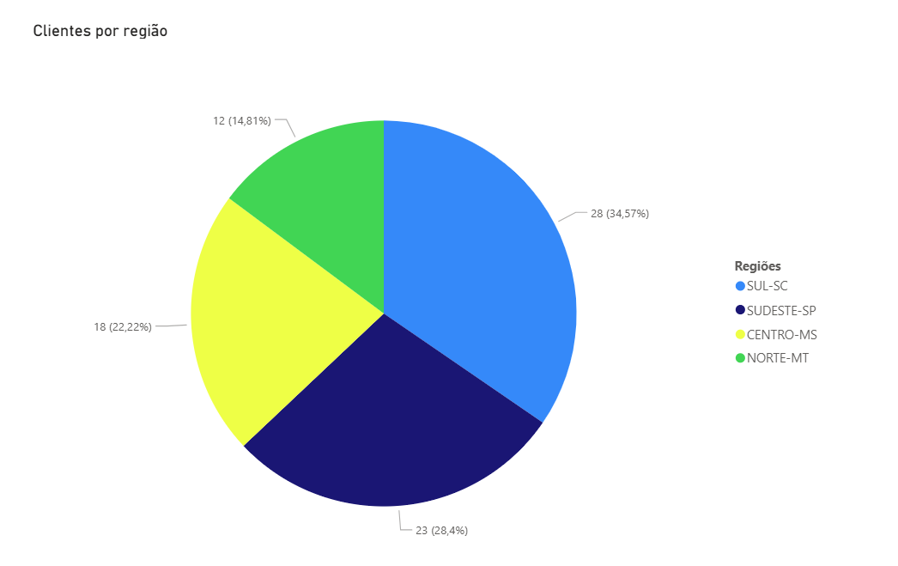
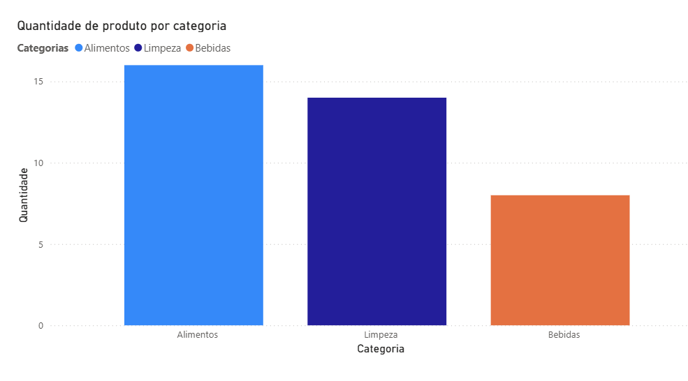
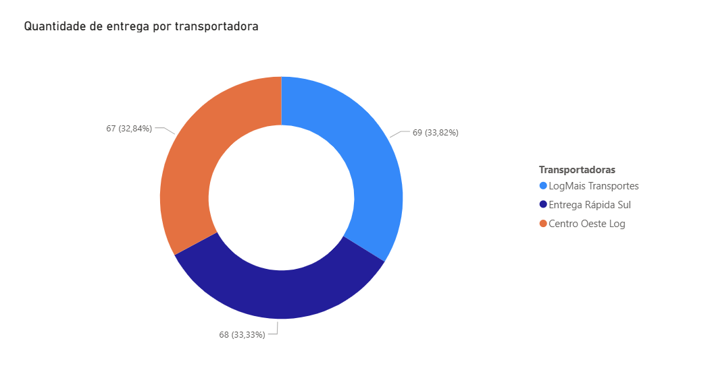
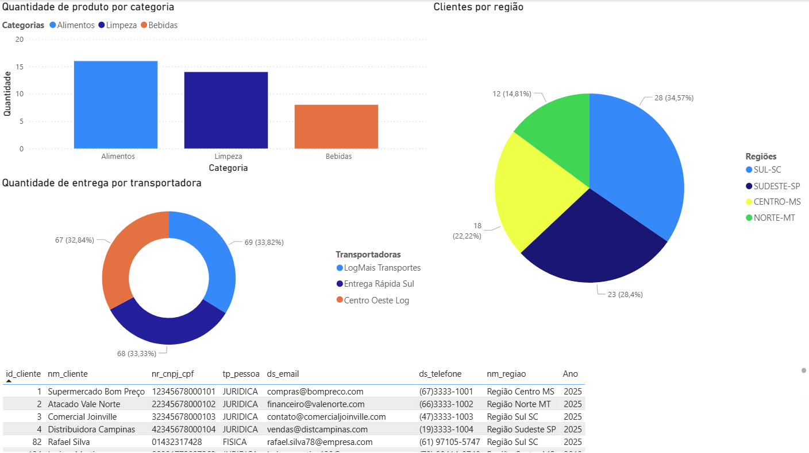

# VendaMais – Plataforma de Inteligência Operacional
# Descrição do Projeto
Este projeto consiste no desenvolvimento de uma Plataforma de Inteligência Operacional para a VendaMais Distribuidora Ltda.. O objetivo central é automatizar a extração de dados do ERP proprietário da empresa, centralizá-los na nuvem Azure e disponibilizar dashboards interativos via Power BI para mitigar problemas de visibilidade de dados e processos manuais demorados. A solução utiliza uma arquitetura de pipeline de dados em camadas (Ingestão, Armazenamento, Transformação e Consumo) para garantir que indicadores de Vendas, Estoque, Financeiro e Logística tenham uma defasagem máxima de 24 horas.

# Integrantes da Equipe
- Matheus Karpinski
- Vitor Machado Blume 
- Rhuan José Voltolini
- Marcelo Momm

# Estrutura do Repositório
A organização das pastas segue os requisitos de documentação técnica e arquitetural

```text

├── docs/
│   ├── adr/              # Architecture Decision Records (Registros de Decisões)
│   │   ├── ADR-001.md    # Estratégia de Ingestão de Dados
│   │   └── ADR-002.md    # Estratégia de Armazenamento de Dados Processados
│   └── c4/               # Diagramas de Arquitetura (Modelo C4)
│       ├── 01-context.md # Documentação do Diagrama de Contexto (Nível 1)
│       ├── 02-container.md # Documentação do Diagrama de Containers (Nível 2)
│       ├── C4-N1.png     # Imagem do Diagrama de Nível 1
│       └── C4-N2.png     # Imagem do Diagrama de Nível 2
└── README.md             # Documentação principal (este arquivo)

```
# Navegação na Documentação
Para compreender as decisões de design e a estrutura técnica da plataforma, acesse os documentos na seguinte ordem:
- Visão Geral: Diagrama de Contexto (C4 Nível 1) para entender a interação do sistema com usuários e sistemas externos.
- Arquitetura de Containers: Diagrama de Container (C4 Nível 2) para visualizar a decomposição da solução em serviços Azure.
- Decisões Técnicas: ADR-001 (Ingestão): Justificativa para o uso de Azure Functions (Serverless). ADR-002 (Armazenamento): Justificativa para o uso do Azure SQL Database.


# Power BI - Dashboard

O dashboard desenvolvido utilizando os dados extraídos do ERP do professor e processados pela solução para apresentar indicadores gerenciais de forma visual.


# Clientes por região

Esse gráfico de pizza apresenta a quantidade de clientes por regiões do Brasil.


# Quantidade de produto por categoria

Esse gráfico de barras indica a quantidade de produtos em estoque por categoria.


# Quantidade de entrega por transportadora

Esse gráfico de rosca apresenta a quantidade de entrega feita por cada transportadora parceira.


# Dashboard completo

Visualização geral dos dados extraídos do ERP 
